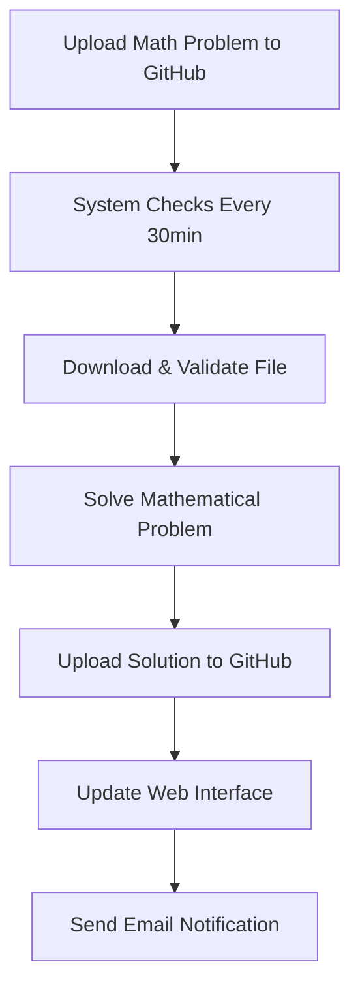

# 🚀 Quick Start Guide

**⚠️ FOR TESTING PURPOSES ONLY ⚠️**

Get your Automated Math Solver up and running in minutes!

## 📋 Prerequisites

- GitHub repository: [TheEMeraldNetwork/Compiti-test](https://github.com/TheEMeraldNetwork/Compiti-test)
- Gmail account: `davideconsiglio1978@gmail.com`
- Python 3.8+ and Tesseract OCR installed

## ⚡ 5-Minute Setup

### 1. **Get Your Credentials**

**GitHub Token:**
1. Go to [GitHub Settings → Developer settings → Personal access tokens](https://github.com/settings/tokens)
2. Click "Generate new token (classic)"
3. Select scopes: `repo` (full control of private repositories)
4. Copy the generated token

**Gmail App Password:**
1. Enable 2-factor authentication on your Gmail account
2. Go to [Google Account Security](https://myaccount.google.com/security)
3. Under "2-Step Verification" → "App passwords"
4. Generate password for "Mail"
5. Copy the 16-character password

### 2. **Configure Environment**

**🔐 SECURITY: Never commit actual credentials to GitHub!**

```bash
# Copy template to create your local .env file
cp env_example.txt .env

# Edit .env with your actual credentials (this file is in .gitignore)
nano .env
```

Add your actual credentials to `.env`:
```bash
# Your GitHub token
GITHUB_TOKEN=ghp_your_actual_token_here

# Your email configuration
EMAIL_SENDER=davideconsiglio1978@gmail.com
EMAIL_PASSWORD=your_16_character_app_password
```

**⚠️ The .env file is excluded from git commits for security!**

### 3. **Launch the System**

```bash
# Start the complete system with web interface
python app.py start --web

# Or just start the scheduler
python app.py start
```

### 4. **Access Web Interface**

Open: http://localhost:5000

## 🧪 Test the System

### Quick Test Commands:
```bash
# Test all components
python app.py test --email --github

# Manual trigger (for immediate testing)
python app.py trigger

# Check system status
python app.py status
```

### Upload a Test Problem:
1. Go to [your repository](https://github.com/TheEMeraldNetwork/Compiti-test)
2. Create `problems` folder
3. Upload a file with: "Solve x^2 + 5x + 6 = 0"
4. Trigger manually: `python app.py trigger`
5. Check the `solutions` folder for the result!

## 📱 How It Works



## 🎯 Supported Problem Types

- **Equations**: `x^2 + 5x + 6 = 0`
- **Derivatives**: `Find derivative of x^3 + 2x`
- **Integrals**: `Calculate integral of sin(x)`
- **Simplification**: `Simplify (x+1)(x-1)`
- **Basic Math**: `Calculate 2 + 3 * 4`

## 📁 File Formats

- **PDF**: Mathematical problems in PDF format
- **Images**: JPG, PNG (uses OCR)
- **Text**: TXT, MD files

## 🔧 Common Commands

```bash
# Start everything
python app.py start --web --host 0.0.0.0 --port 5000

# Web interface only
python app.py web

# Background scheduler only
python app.py start

# Manual processing
python app.py trigger

# System health check
python app.py status

# Test components
python app.py test --email --github
```

## 🚨 Troubleshooting

### GitHub Issues:
- **"Authentication failed"**: Check your GitHub token
- **"Repository not found"**: Verify repository name in config.yaml

### Email Issues:
- **"SMTP authentication failed"**: Check Gmail app password
- **"Connection refused"**: Enable 2-factor authentication first

### Math Solver Issues:
- **"No mathematical content"**: Ensure problem contains math keywords
- **"Unsupported format"**: Use PDF, JPG, PNG, TXT, or MD files

### Quick Fixes:
```bash
# Reset environment
rm .env && cp env_example.txt .env

# Reinstall dependencies
pip install -r requirements.txt

# Check logs
tail -f logs/math_solver.log
```

## ⚙️ Configuration

Main settings in `config.yaml`:
- **Repository**: `TheEMeraldNetwork/Compiti-test`
- **Check Interval**: 30 minutes
- **Upload Folder**: `problems`
- **Solutions Folder**: `solutions`

## 🎉 Success Indicators

✅ **System Working When You See:**
- Web interface loads at http://localhost:5000
- `python app.py status` shows "is_running: true"
- Test commands pass: `python app.py test --email --github`
- Solutions appear in GitHub after uploading problems

## 📞 Need Help?

1. **Check Logs**: `logs/math_solver.log`
2. **Run Tests**: `python test_system.py`
3. **Verify Setup**: `python setup.py`
4. **Manual Trigger**: `python app.py trigger`

---

**🎯 Ready to Go!**

Your automated math solver is now configured for:
- Repository: [TheEMeraldNetwork/Compiti-test](https://github.com/TheEMeraldNetwork/Compiti-test)
- Email: davideconsiglio1978@gmail.com
- Checking every 30 minutes
- Manual triggers for testing

**Upload a math problem and watch the magic happen! 🔮**
